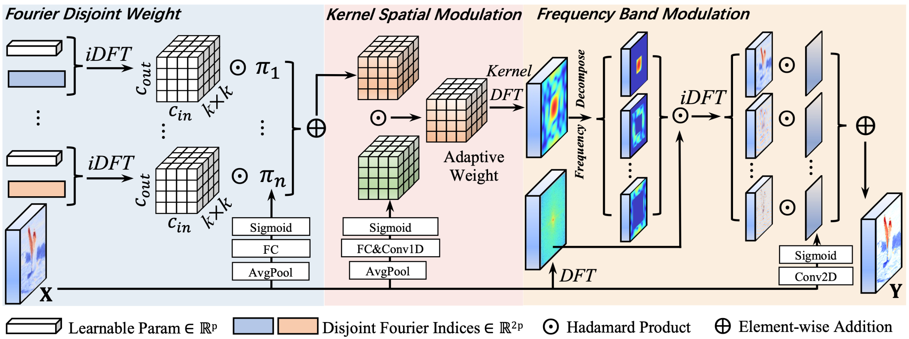

# FDConv

**[CVPR 2025]** Official implementation of *Frequency Dynamic Convolution for Dense Image Prediction*.  
FDConv enhances dynamic convolution by learning frequency-diverse weights in the Fourier domain, achieving state-of-the-art performance with minimal parameter overhead.

[](https://arxiv.org/abs/2503.18783) ←*click here to read the paper~*



## 📰News

- 2025.7.14 Code for training with mmdet using FDConv ([here](./FDConv_detection)).
- 2025.7.5 Code for converting ImageNet pretrained weight to FDConv weight ([here](./tools)).

## 🚀 Key Features

- **Fourier Disjoint Weight (FDW):** Constructs frequency-diverse kernels by learning disjoint spectral coefficients, eliminating parameter redundancy.
- **Kernel Spatial Modulation (KSM):** Dynamically adjusts filter responses at the element-wise level using local-global feature fusion.
- **Frequency Band Modulation (FBM):** Modulates spatial-frequency bands adaptively for context-aware feature extraction.
- **Plug-and-Play:** Seamlessly integrates into ConvNets and Transformers.

## 📈 Performance Highlights

| Task                  | Method                                                       | Metrics (Improvement)  | Params Cost |
| --------------------- | ------------------------------------------------------------ | ---------------------- | ----------- |
| Object Detection      | Faster R-CNN ([config](./FDConv_detection/configs/faster_rcnn/faster_rcnn_r50_fpn_1x_coco_FDConv.py), [download](https://pan.baidu.com/s/1qsKrf8FvnvaURQN8u7BxQA?pwd=CVPR)) | AP↑2.2%                | **+3.6M**   |
| Instance Segmentation | Mask R-CNN ([config](./FDConv_detection/configs/mask_rcnn/mask_rcnn_r50_fpn_1x_coco_adamw_FDConv.py), [download](https://pan.baidu.com/s/1YbKppkjEyfm4LeWXE56WHw?pwd=CVPR)) | AP<sup>mask</sup>↑2.2% | +3.6M       |
| Semantic Segmentation | UPerNet                                                      | mIoU↑3.1%              | +3.6M       |

**Outperforms CondConv (+90M), DY-Conv (+75M), and ODConv (+65M) with 1/20 parameters!**

| Models              | Params                  | FLOPs     | AP<sup>box</sup> | AP<sup>mask</sup> |
| ------------------- | ----------------------- | --------- | ---------------- | ----------------- |
| **Faster R-CNN**    | 43.80<sub>(23.5)</sub>M | 207.1G    | 37.2             | —                 |
| + CondConv (8×)     | +90.0M                  | +0.01G    | 38.1             | —                 |
| + DY-Conv (4×)      | +75.3M                  | +0.16G    | 38.3             | —                 |
| + DCD               | +4.3M                   | +0.13G    | 38.1             | —                 |
| + ODConv (4×)       | +65.1M                  | +0.35G    | 39.2             | —                 |
| **+ FDConv (Ours)** | **+3.6M**               | **+1.8G** | **39.4**         | —                 |
| **Mask R-CNN**      | 46.5<sub>(23.5)</sub>M  | 260.1G    | 39.6             | 36.4              |
| + DY-Conv (4×)      | +75.3M                  | +0.16G    | 39.6             | 36.6              |
| + ODConv (4×)       | +65.1M                  | +0.35G    | 42.1             | 38.6              |
| + KW (1×)           | +2.5M                   | —         | 41.8             | 38.4              |
| + KW (4×)           | +76.5M                  | —         | 42.4             | **38.9**          |
| **+ FDConv (Ours)** | **+3.6M**               | **+1.8G** | **42.4**         | 38.6              |

## 🏎️ Quick Start

Code of FDConv is [here](./FDConv_detection/mmdet_custom/FDConv.py)

```python
from FDConv import FDConv

# Replace standard convolution in your model
model.conv = FDConv(in_channels=64, out_channels=64, kernel_size=3, kernel_num=64)
```

## 🛠 Installation

You can install mmdet as third party library following the guidence of [mmdetection](https://github.com/open-mmlab/mmdetection/tree/dev-2.x) [Installation](https://mmdetection.readthedocs.io/en/v2.8.0/get_started.html#installation).

```
conda create -n FDConv_mmdet python=3.7 -y
conda activate FDConv_mmdet
# install torch
pip install torch==1.11.0+cu113 torchvision==0.12.0+cu113 -f https://download.pytorch.org/whl/torch_stable.html
# install mmcv
pip install mmcv-full==1.5.3 -f https://download.openmmlab.com/mmcv/dist/cu113/torch1.11/index.html
# install mmdet
pip install -r ./requirements.txt
pip install mmdet==2.28.1
```

## 🚞 Training

```
conda activate FDConv_mmdet
CUDA_VISIBLE_DEVICES=0,1 local_path_to/dist_train.sh \
local_path_to/configs/faster_rcnn/faster_rcnn_r50_fpn_1x_coco_FDConv.py \
2 \
--work-dir local_path_to/save_dir \
--cfg-options model.backbone.init_cfg.checkpoint='local_path_to/resnet50_Convert2FDConv.pth'
```

You can obtain resnet50_Convert2FDConv.pth by using the script bellow, or download from [here](https://pan.baidu.com/s/1lKfNNEjJUYGsBRTEXjCVvQ?pwd=CVPR).

## 🙇Testing

```
conda activate FDConv_mmdet
CUDA_VISIBLE_DEVICES=0,1,2,3 /local_path_to/dist_test.sh \
local_path_to/configs/mask_rcnn/mask_rcnn_r50_fpn_1x_coco_adamw_FDConv.py \
local_path_to/checkpoint.pth 4 \
--eval bbox segm
```

## 🔄 Using Pre-trained Models with FDConv

The FDConv layer replaces standard nn.Conv2d or nn.Linear layers. To leverage official pre-trained weights (e.g., from ImageNet), you must first convert their standard spatial-domain weights into our Fourier-domain format (.dft_weight). We provide a versatile script to automate this process.

### The Conversion Script

The script tools/convert_to_fdconv.py handles the conversion. It loads a standard checkpoint, identifies target layers based on the specified model architecture, transforms their weights using 2D Fast Fourier Transform (FFT), and saves a new checkpoint compatible with models using FDConv.

### Usage

The general command is:

```
python tools/convert_to_fdconv.py \
    --model_type <MODEL_TYPE> \
    --weight_path <PATH_TO_ORIGINAL_WEIGHTS> \
    --save_path <PATH_TO_SAVE_CONVERTED_WEIGHTS>
```

- --model_type: Specify the architecture. Currently supported: resnet for ResNet-like models, and vit for Transformer models (like SegFormer).
- --weight_path: Path to the downloaded official pre-trained weights.
- --save_path: Path where the new, converted weights will be saved.

### Examples

#### Example 1: Converting a ResNet-50 Model

To convert an official ImageNet pre-trained ResNet-50 model for use with FDConv:

1. Download the official ResNet-50 weights ([here](https://download.pytorch.org/models/resnet50-0676ba61.pth)).
2. Run the conversion script:

```
python tools/convert_to_fdconv.py \
    --model_type resnet \
    --weight_path /path/to/your/resnet50.pth \
    --save_path /path/to/your/resnet50_fdconv.pth
```

This will find weights like layer1.0.conv1.weight, convert them to layer1.0.conv1.dft_weight, and save the complete modified state dictionary to resnet18_fdconv.pth.

#### Example 2: Converting a SegFormer (MiT-B0) Model

Transformer-based models like SegFormer use linear layers in their Feed-Forward Networks (FFNs), which can be replaced by FDConv (as 1x1 convolutions).

1. Download the pre-trained MiT-B0 weights (e.g., mit_b0.pth).
2. Run the script with vit type:

```
python tools/convert_to_fdconv.py \
    --model_type vit \
    --weight_path /path/to/your/mit_b0.pth \
    --save_path /path/to/your/mit_b0_fdconv.pth
```

This will target the FFN linear layers (e.g., block1.0.ffn.layers.0.0.weight), convert them, and save the new checkpoint.

After conversion, you can load the generated .pth file into your model architecture where standard layers have been replaced by FDConv.


## 📖 Citation

If you find this work useful, please cite:

```
@inproceedings{chen2025frequency,
  title={Frequency Dynamic Convolution for Dense Image Prediction},
  author={Chen, Linwei and Gu, Lin and Li, Liang and Yan, Chenggang and Fu, Ying},
  booktitle={Proceedings of the Computer Vision and Pattern Recognition Conference},
  pages={30178--30188},
  year={2025}
}
```

<picture>
  <source
    media="(prefers-color-scheme: dark)"
    srcset="
      https://api.star-history.com/svg?repos=Linwei-Chen/FDConv&type=Date&theme=dark
    "
  />
  <source
    media="(prefers-color-scheme: light)"
    srcset="
      https://api.star-history.com/svg?repos=Linwei-Chen/FDConv&type=Date
    "
  />
  
</picture>

## Acknowledgment

This code is built using [mmsegmentation](https://github.com/open-mmlab/mmsegmentation), [mmdetection](https://github.com/open-mmlab/mmdetection/tree/dev-2.x) libraries.

## Contact

If you encounter any problems or bugs, please don't hesitate to contact me at [chenlinwei@bit.edu.cn](chenlinwei@bit.edu.cn), [charleschen2013@163.com](charleschen2013@163.com). To ensure effective assistance, please provide a brief self-introduction, including your name, affiliation, and position. If you would like more in-depth help, feel free to provide additional information such as your personal website link. I would be happy to discuss with you and offer support.